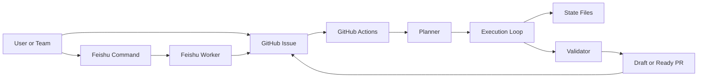
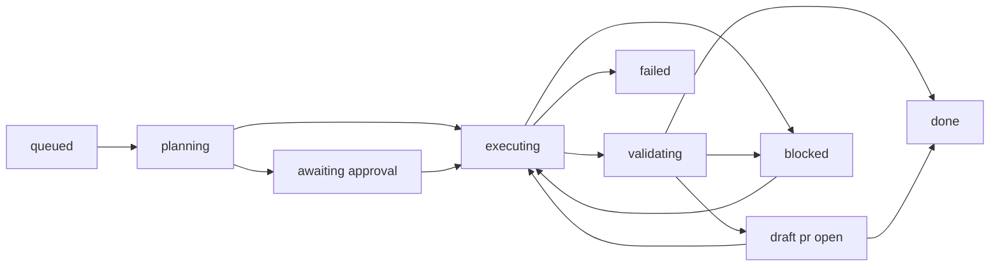

<p align="center">
  
</p>

<h1 align="center">Ralph</h1>

<p align="center"><strong>Let Ralph code while you sleep.</strong></p>

<p align="center">An issue-driven AI coding agent for reliable GitHub execution.</p>

<p align="center">
  <a href="./README_CN.md">中文</a>
  ·
  <a href="./feishu/README.md">Feishu</a>
  ·
  <a href="./docs/rearchitecture-plan.md">Architecture</a>
  ·
  <a href="./CONTRIBUTING.md">Contributing</a>
  ·
  <a href="./SECURITY.md">Security</a>
</p>

<p align="center">
  
  
  
  
</p>

Ralph turns GitHub Issues into planned, validated, and reviewable Pull Requests.

Instead of relying on a single long coding run, it uses a stricter engineering loop: plan first, execute one runnable subtask per run, persist state, update the same PR, and only declare completion when validation passes.

Inspired by [Geoffrey Huntley's Ralph pattern](https://ghuntley.com/ralph/) and adapted toward a more reliable issue-to-PR system.

## Open Source

- Start with [Contributing](./CONTRIBUTING.md) before sending larger changes.
- Report sensitive vulnerabilities through [Security](./SECURITY.md), not public issues.
- Use [Support](./SUPPORT.md) for contribution and support expectations.

## Quick Demo

```text
GitHub Issue / Feishu command
        ↓
Ralph plans the task
        ↓
Ralph executes one runnable subtask
        ↓
Ralph validates the result
        ↓
Ralph updates the same draft PR
        ↓
Validation passes → issue closes
```

## Architecture Diagram



## At A Glance

- `Issue -> Plan -> Runnable Subtask -> Validation -> PR` instead of a single long prompt loop.
- Draft PR stays open while the task is still evolving.
- `.ralph/subtasks/*.json` and `.ralph/execution-result.json` persist orchestration state.
- Feishu acts as ingress and notification, while GitHub Issue and PR remain the source of truth.

## Use Cases

| Scenario | Why Ralph fits |
|---|---|
| Overnight feature delivery | Ralph can keep executing from issue to draft PR without requiring a long interactive session. |
| Large refactors | Plan-first orchestration reduces the chance of a single brittle prompt trying to change everything at once. |
| Team chat to repo workflow | Feishu commands can create and control work while GitHub stays as the execution source of truth. |
| Cross-repo automation | A central Ralph deployment can dispatch work into another repository while preserving routing and reporting. |
| Validator-gated coding | Useful when "code was generated" is not enough and completion must depend on explicit validation. |

## Comparison

| Approach | Typical limitation | Ralph's stance |
|---|---|---|
| Single long-prompt coding agent | Tends to lose structure on larger tasks | Plan first, then execute one runnable subtask at a time |
| Trigger-only issue bot | Can start work, but often lacks persistent task memory | Persists subtasks and execution state across workflow runs |
| Chat-first coding workflow | Easy to drift away from audited repo state | GitHub issue and PR remain the source of truth |
| Code generation without gatekeeping | "Generated code" can be mistaken for "done" | Completion is gated by explicit validation |
| Human-only issue handling | Strong control, weak automation throughput | Keeps human checkpoints while automating the repetitive path |

## Why Ralph

| Capability | What it means |
|---|---|
| Validator-first completion | A branch with commits is not considered success unless validation passes. |
| Incremental orchestration | Ralph executes one runnable subtask per workflow run and then continues automatically. |
| Draft PR first | Work becomes visible early without pretending the task is done. |
| Cross-repo ready | Central orchestration can operate on another target repo and keep routing attached to the original issue. |
| Feishu ingress | Teams can create, approve, reject, and track tasks from chat while GitHub remains the source of truth. |

## What Changed From Classic Ralph

| Area | Classic pattern | Ralph in this repo |
|---|---|---|
| Success condition | Often inferred from "the agent produced code" | Success is gated by validator output |
| Execution model | One long run tries to finish everything | One runnable subtask per workflow run |
| PR posture | PR often appears only at the end | Draft PR appears early and gets updated incrementally |
| Task memory | Mostly implicit in logs or commits | `.ralph/subtasks/*.json` and `.ralph/execution-result.json` persist state |
| Chat integration | Usually trigger-only | Feishu can trigger, approve, reject, and receive notifications |
| Issue lifecycle | Easy to drift from real status | Issue closes only on validator `pass` |

## Navigation

- [Quick Demo](#quick-demo)
- [Architecture Diagram](#architecture-diagram)
- [Use Cases](#use-cases)
- [Comparison](#comparison)
- [How It Works](#how-it-works)
- [State Machine](#state-machine)
- [End-to-End Example](#end-to-end-example)
- [Quick Start](#quick-start)
- [Completion Rules](#completion-rules)
- [Execution Modes](#execution-modes)
- [Repo Creation](#repo-creation)
- [Backends](#backends)
- [Architecture](#architecture)
- [Configuration](#configuration)
- [Workflow Dispatch Options](#workflow-dispatch-options)

## How It Works

```
1. You create a GitHub Issue describing what you want
2. You add the label `ai/ready`
3. Ralph wakes up (GitHub Actions)
4. Ralph plans the task (decomposes into subtasks if complex)
5. [Optional] Ralph posts the plan for your approval
6. Ralph executes one runnable subtask per workflow run with ReAct loops (Reason → Act → Observe)
7. Ralph persists progress, re-dispatches itself if more subtasks remain, and updates the same draft PR
8. Ralph validates changes; only validator `pass` can close the issue
9. You wake up to a draft PR or a ready-for-review PR with validation status attached
```

## State Machine



Rules:
- `done` is reachable only after validation result `pass`.
- `draft pr open` means work is visible, not complete.
- `blocked` keeps the issue open and preserves branch / PR context.

## End-to-End Example

1. Create issue `#42` with a scoped requirement such as "split auth service into provider + session modules".
2. Add label `ai/ready`.
3. Ralph generates a structured plan and posts it to the issue.
4. If approval is required, reply `/approve`.
5. Ralph executes one runnable subtask, commits progress, and updates the same draft PR.
6. The workflow auto-dispatches the next run if more subtasks remain.
7. `scripts/validator.sh` writes `.ralph/validation-result.json`.
8. If validation is `partial`, the draft PR stays open and the issue remains open.
9. If validation is `pass`, Ralph marks the PR ready for review, adds `ai/done`, and closes the issue.

Recommended Feishu input:

```text
/ralph
Goal: redesign the homepage
Requirements: modern visual style, responsive layout, include hero and gallery
Constraints: keep current stack, do not change CI
Acceptance: mobile works, no console errors
```

## Quick Start

### 1. Copy into your project

```bash
# Option A: Setup script
git clone https://github.com/YOUR_GITHUB_USER/ralph.git /tmp/ralph
cd YOUR_PROJECT && /tmp/ralph/scripts/setup.sh

# Option B: Manual
mkdir -p .github/workflows scripts/lib
curl -sL https://raw.githubusercontent.com/YOUR_GITHUB_USER/ralph/main/.github/workflows/ralph.yml > .github/workflows/ralph.yml
curl -sL https://raw.githubusercontent.com/YOUR_GITHUB_USER/ralph/main/ralph.sh > ralph.sh
curl -sL https://raw.githubusercontent.com/YOUR_GITHUB_USER/ralph/main/scripts/i18n.cjs > scripts/i18n.cjs
curl -sL https://raw.githubusercontent.com/YOUR_GITHUB_USER/ralph/main/scripts/validator.sh > scripts/validator.sh
curl -sL https://raw.githubusercontent.com/YOUR_GITHUB_USER/ralph/main/scripts/lib/i18n.sh > scripts/lib/i18n.sh
curl -sL https://raw.githubusercontent.com/YOUR_GITHUB_USER/ralph/main/scripts/lib/planning.sh > scripts/lib/planning.sh
curl -sL https://raw.githubusercontent.com/YOUR_GITHUB_USER/ralph/main/scripts/lib/reporting.sh > scripts/lib/reporting.sh
curl -sL https://raw.githubusercontent.com/YOUR_GITHUB_USER/ralph/main/scripts/lib/execution.sh > scripts/lib/execution.sh
mkdir -p locales/core
curl -sL https://raw.githubusercontent.com/YOUR_GITHUB_USER/ralph/main/locales/core/zh-CN.json > locales/core/zh-CN.json
curl -sL https://raw.githubusercontent.com/YOUR_GITHUB_USER/ralph/main/locales/core/en-US.json > locales/core/en-US.json
chmod +x scripts/validator.sh scripts/lib/*.sh
chmod +x ralph.sh
```

### 2. Set up secrets

In your repo's Settings → Secrets → Actions:

| Secret | Required For | Description |
|--------|-------------|-------------|
| `RALPH_API_KEY` | `opencode` / `llm` backend | Any OpenAI-compatible API key |
| `RALPH_GITHUB_TOKEN` | All backends | A PAT with `repo` scope (required for cross-repo and repo creation) |

Required repo variables (Settings → Variables → Actions):

| Variable | Required | Description |
|----------|----------|-------------|
| `RALPH_API_BASE_URL` | Yes (for `opencode`/`llm`) | OpenAI-compatible API base URL |
| `RALPH_API_MODEL` | Yes (for `opencode`/`llm`) | Model name |
| `RALPH_API_PROTOCOL` | No (default: `openai`) | API protocol: `openai` or `anthropic` |
| `RALPH_PLAN_TIMEOUT` | No (default: `30`) | Minutes to wait for plan approval |

Notes:
- Ralph only reads `RALPH_API_BASE_URL`, `RALPH_API_MODEL`, and `RALPH_API_KEY` as runtime model configuration.
- Set all three explicitly for both `opencode` and `llm`.
- In `plan_mode=auto`, very low-context issues stop before coding and ask for clarification instead of guessing.
- If you use Feishu, set `RALPH_LANG` to the same value in both Cloudflare Worker and GitHub Actions Variables to keep non-Feishu-triggered runs in the same default language.

### 3. Create labels

- `ai/ready` — `#7057ff` (purple) — triggers Ralph
- `ai/done` — `#0e8a16` (green) — Ralph succeeded
- `ai/failed` — `#d93f0b` (red) — Ralph needs help
- `ai/plan-approved` — `#1d76db` (blue) — approve Ralph's plan
- `ralph` — `#6f42c1` (purple) — marks Ralph PRs

### 4. Create an issue, label it `ai/ready`, sleep 💤

## Completion Rules

- `scripts/validator.sh` is the completion gate.
- `ai/done` is only added when validation result is `pass`.
- Validation `partial` keeps the issue open and the PR in draft state.
- Low-context issues can exit early with `clarification_needed`, which keeps the issue open and skips code generation.
- Ralph persists plan state in `.ralph/subtasks/*.json` and execution state in `.ralph/execution-result.json`.
- Execution state now uses a single structured source: `status`, `stage`, `summary`, and `failure_code`.

## Execution Modes

### Plan-and-Execute + ReAct (default)

For complex tasks, Ralph first creates a structured plan, then executes one runnable subtask per workflow run:

```
┌─ Plan Phase ──────────────────────────────────┐
│  LLM analyzes issue → outputs JSON plan       │
│  {complexity, subtasks[], clarifications[]}    │
│                                                │
│  complexity = simple → execute directly        │
│  complexity = complex → subtask decomposition  │
│  complexity = ambiguous → wait for human input │
└───────────────────────────────────────────────┘
        │
        ▼
┌─ Human Checkpoint (optional) ─────────────────┐
│  Posts plan to issue as checklist               │
│  Waits for /approve comment or label            │
│  /reject cancels execution                      │
└───────────────────────────────────────────────┘
        │
        ▼
┌─ ReAct Loop (per subtask) ────────────────────┐
│  🧠 Reason: analyze state, plan approach       │
│  ⚡ Act: write code changes                    │
│  👁️ Observe: run tests, check results          │
│  ↩️ If failed: feed observation back to Reason  │
│  ✅ If passed: commit and persist subtask state  │
└───────────────────────────────────────────────┘
        │
        ▼
┌─ Validation + Continuation ───────────────────┐
│  validator writes .ralph/validation-result.json│
│  more subtasks → auto-dispatch next workflow   │
│  final pass → mark PR ready + close issue      │
└───────────────────────────────────────────────┘
```

### Legacy Loop (backward compatible)

Set `plan_mode=off` to use the classic loop: Code → Test → Self-Review → Fix → Commit.

## Repo Creation

Ralph can create new repositories from scratch:

```bash
# Create a new repo and implement the issue requirements
gh workflow run ralph.yml \
  -f issue_number=1 \
  -f target_repo=myorg/new-project \
  -f create_repo=true \
  -f repo_visibility=private \
  -f repo_description="My new project"
```

The issue describes what to build; Ralph creates the repo, initializes it, and implements the code.

## Backends

### OpenCode (default, OpenAI-compatible, agent capabilities) ⭐
```bash
RALPH_AGENT_BACKEND=opencode
RALPH_API_BASE_URL=https://your-api-provider.com/openai
RALPH_API_MODEL=your-model-name
RALPH_API_KEY=your_key
```
Uses OpenCode CLI with full agent capabilities — file R/W, tools, MCP, skills. Works with any OpenAI-compatible API.

Runtime behavior:
- Ralph writes live OpenCode output to `.ralph/opencode-run.log`.
- GitHub Actions now prints heartbeat lines during long OpenCode runs instead of staying silent.
- Heartbeat lines include the latest OpenCode log hint when available, so long waits stay inspectable.
- Each OpenCode run is still bounded by `RALPH_OPENCODE_TIMEOUT`, default `900` seconds.
- In `plan_mode=auto`, simple or low-context issues now prefer the legacy loop and clamp retry count to reduce wasted runtime.

### LLM (plain API fallback)
```bash
RALPH_AGENT_BACKEND=llm
RALPH_API_BASE_URL=https://your-api-provider.com/openai
RALPH_API_MODEL=your-model-name
RALPH_API_KEY=your_key
```
Works with **any OpenAI-compatible API** (DeepSeek, Qwen, OpenAI, Ollama, etc.)

## Architecture

```
┌──────────────────────────────────────────────────────────────┐
│                     GitHub Actions                            │
│                                                              │
│  ┌──────────┐    ┌──────────┐    ┌───────────────────────┐   │
│  │  Trigger  │───▶│  Plan    │───▶│  ReAct Loop           │   │
│  │ (labeled) │    │ (decomp) │    │  per subtask          │   │
│  └──────────┘    └────┬─────┘    │  🧠 Reason → ⚡ Act    │   │
│                       │          │  → 👁️ Observe → loop   │   │
│                  ┌────▼─────┐    └────────┬──────────────┘   │
│                  │  Human   │             │                   │
│                  │Checkpoint│    ┌────────▼──────────────┐   │
│                  │(optional)│    │  Self-Review + Commit  │   │
│                  └──────────┘    └────────┬──────────────┘   │
│                                          │                   │
│                                   ┌──────▼──────┐           │
│                                   │ Push + PR    │           │
│                                   └──────┬──────┘           │
│                                          │                   │
│                                   ┌──────▼──────┐           │
│                                   │Formal Review │           │
│                                   └─────────────┘           │
└──────────────────────────────────────────────────────────────┘
```

## Anti-Cheat: Test Protection

Ralph is **not allowed to modify test files**. A git pre-commit hook blocks changes to `*_test.*`, `*_spec.*`, `test_*.*`, and `*.test.*` files. The LLM backend also filters protected files before writing.

## Configuration

| Variable | Default | Description |
|----------|---------|-------------|
| `RALPH_MAX_ITERATIONS` | `5` | Max retry loops (legacy mode) |
| `RALPH_TEST_COMMAND` | auto-detect | Your test command |
| `RALPH_AGENT_BACKEND` | `opencode` | Backend: `opencode` \| `llm` |
| `RALPH_BRANCH_PREFIX` | `ralph/issue-` | Branch naming prefix |
| `RALPH_PROTECTED_PATTERNS` | `*_test.* ...` | Test file patterns |
| `RALPH_API_BASE_URL` | - | OpenAI-compatible base URL (required for opencode/llm) |
| `RALPH_API_KEY` | - | API key (required for opencode/llm) |
| `RALPH_API_MODEL` | - | Model name (required for opencode/llm) |
| `RALPH_API_PROTOCOL` | `openai` | API protocol: `openai` or `anthropic` |
| `RALPH_API_MAX_TOKENS` | `32768` | Max tokens for LLM response |
| `RALPH_OPENCODE_TIMEOUT` | `900` | Max seconds allowed for one OpenCode run |
| `RALPH_OPENCODE_HEARTBEAT_SECONDS` | `30` | Seconds between OpenCode heartbeat log lines |
| `RALPH_AUTO_REQUIRE_CONTEXT` | `true` | In `auto` mode, stop low-context issues before coding and ask for clarification |
| `RALPH_LANG` | `zh-CN` | Default user-facing language for workflow comments and review output |
| `RALPH_PLAN_MODE` | `auto` | `auto` \| `always` \| `off` |
| `RALPH_PLAN_EXECUTION_MODE` | `single` | `single` \| `multi` |
| `RALPH_REQUIRE_PLAN_APPROVAL` | `false` | Wait for human to approve plan |
| `RALPH_PLAN_TIMEOUT` | `30` | Minutes to wait for approval |
| `RALPH_REACT_MAX_RETRIES` | `3` | ReAct retries per subtask |

Test command auto-detection:
- `Makefile` with `test:` → `make test`
- `package.json` → `npm test`
- `go.mod` → `go test ./...`
- `Cargo.toml` → `cargo test`
- `pyproject.toml` → `pytest`

## Workflow Dispatch Options

| Input | Default | Description |
|-------|---------|-------------|
| `issue_number` | required | Issue to work on |
| `target_repo` | current repo | Target repo (`owner/repo`) |
| `create_repo` | `false` | Create repo if it doesn't exist |
| `repo_visibility` | `public` | Visibility for new repos |
| `repo_description` | `""` | Description for new repos |
| `backend` | `auto` | AI backend to use |
| `max_iterations` | `5` | Max iterations (legacy mode) |
| `plan_mode` | `auto` | Planning mode |
| `plan_execution_mode` | `single` | Execute one runnable subtask per run or all subtasks in one run |
| `require_approval` | `false` | Require human approval |
| `auto_merge` | `false` | Auto-merge PR if CI passes |
| `feishu_chat_id` | `""` | Feishu chat_id for notifications (auto-filled by Worker) |

## Troubleshooting

### Plan mode falls back immediately

Ralph only reads these workflow values:

- `RALPH_API_BASE_URL`
- `RALPH_API_MODEL`
- `RALPH_API_KEY`

If planning falls back unexpectedly, verify these three are present in the workflow environment.

### OpenCode looks stuck in GitHub Actions

Check these before treating the run as hung:

- workflow heartbeat lines like `OpenCode still running... 30s elapsed`
- workflow heartbeat lines like `OpenCode still running... 30s elapsed | latest: ...`
- `.ralph/opencode-run.log` in the runner workspace
- `/logs [issue#]` from Feishu to fetch the current run URL

If both heartbeat and OpenCode output are missing, inspect the API base URL, model, and key first.

### Ralph stopped and asked for clarification

This is expected when the issue body is too short or underspecified in `plan_mode=auto`.

Ralph now prefers stopping before code generation instead of guessing from a vague title.
Add at least two of these, then rerun:

- goal
- specific requirements
- constraints
- acceptance criteria

### Feishu cards are Chinese but GitHub issue comments are English

Language priority is:

1. workflow input `lang`
2. issue metadata `ralph-meta.lang`
3. GitHub variable `RALPH_LANG`

For stable defaults across Feishu and non-Feishu triggers, set Cloudflare Worker `RALPH_LANG` and GitHub Actions Variable `RALPH_LANG` to the same value.

### Examples

```bash
# Simple task with auto mode
gh workflow run ralph.yml -f issue_number=42

# Complex task with human approval
gh workflow run ralph.yml -f issue_number=42 -f plan_mode=always -f require_approval=true

# Default orchestrated mode: one runnable subtask per workflow run
gh workflow run ralph.yml -f issue_number=42 -f plan_mode=always -f plan_execution_mode=single

# Cross-repo with specific backend
gh workflow run ralph.yml -f issue_number=42 -f target_repo=myorg/api -f backend=llm

# Create a new project from scratch
gh workflow run ralph.yml -f issue_number=1 -f target_repo=myorg/new-app -f create_repo=true -f repo_visibility=private

# Legacy mode (no planning)
gh workflow run ralph.yml -f issue_number=42 -f plan_mode=off -f max_iterations=10
```

### Local execution
```bash
export RALPH_API_KEY=your_key
export GITHUB_TOKEN=your_token
export ISSUE_NUMBER=42
export REPO_FULL_NAME=owner/repo
export RALPH_PLAN_MODE=auto        # auto | always | off
export RALPH_PLAN_EXECUTION_MODE=single
./ralph.sh
```

## Human-in-the-Loop Commands

When Ralph posts a plan on an issue, you can respond with:

| Command | Effect |
|---------|--------|
| `/approve` | Approve the plan, Ralph continues execution |
| `/reject` | Reject the plan, Ralph aborts |
| Add label `ai/plan-approved` | Same as `/approve` |

## Difficulty Guide

| Give to Ralph ✅ | Keep for humans 🧑‍💻 |
|---|---|
| Add/modify fields | Multi-service orchestration |
| Format conversions | Database schema changes |
| CRUD endpoints | Authentication/authorization |
| Enum additions | Performance-critical paths |
| Config changes | Complex state machines |
| Bug fixes with clear repro | Architectural decisions |
| New project scaffolding | Security-critical code |

## Credits

- [Geoffrey Huntley](https://ghuntley.com/ralph/) — Original Ralph concept
- [snarktank/ralph](https://github.com/snarktank/ralph) — Classic bash implementation
- [ralph-orchestrator](https://github.com/mikeyobrien/ralph-orchestrator) — Multi-backend orchestrator
- [awesome-ralph](https://github.com/snwfdhmp/awesome-ralph) — Curated resource list

## License

MIT
