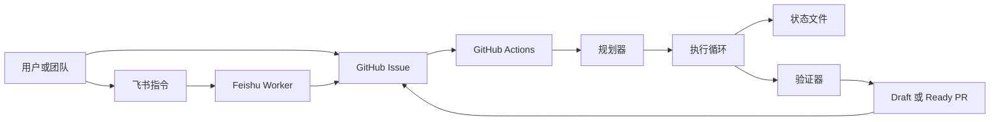
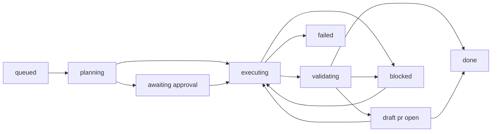

<p align="center">
  
</p>

<h1 align="center">Ralph</h1>

<p align="center"><strong>让 Ralph 替你写代码，你只管睡觉。</strong></p>

<p align="center">一个面向 GitHub 可靠执行的 Issue 驱动型 AI 编码 Agent。</p>

<p align="center">
  <a href="./README.md">English</a>
  ·
  <a href="./feishu/README.md">Feishu</a>
  ·
  <a href="./docs/rearchitecture-plan.md">架构说明</a>
  ·
  <a href="./CONTRIBUTING.md">贡献指南</a>
  ·
  <a href="./SECURITY.md">安全策略</a>
</p>

<p align="center">
  
  
  
  
</p>

Ralph 会把 GitHub Issue 变成有计划、有验证、可审查的 Pull Request。

它不是“一次长 prompt 硬做到底”的工具，而是更接近工程编排器：先规划，再每次只推进一个可执行子任务，持久化状态，持续更新同一个 PR，只有验证通过才宣布完成。

灵感来自 [Geoffrey Huntley 的 Ralph 模式](https://ghuntley.com/ralph/)，但目标是把它落到更可靠的 issue-to-PR 流程里。

## 开源协作

- 提交较大改动前，先看 [Contributing](./CONTRIBUTING.md)。
- 安全问题不要公开提 issue，走 [Security](./SECURITY.md)。
- 常规使用与协作说明见 [Support](./SUPPORT.md)。

## 快速演示

```text
GitHub Issue / 飞书命令
        ↓
Ralph 先生成执行计划
        ↓
Ralph 执行一个可运行子任务
        ↓
Ralph 做验证
        ↓
Ralph 更新同一个 Draft PR
        ↓
验证通过 → 关闭 Issue
```

## 架构图



## 一眼看懂

- 从 `Issue -> Plan -> Runnable Subtask -> Validation -> PR` 推进，而不是单次长循环。
- 任务未完全验证通过前，PR 默认保持 Draft。
- `.ralph/subtasks/*.json` 和 `.ralph/execution-result.json` 保存真实编排状态。
- Feishu 只负责入口和通知，GitHub Issue / PR 才是任务真相源。

## 适用场景

| 场景 | 为什么适合 Ralph |
|---|---|
| 夜间自动交付功能 | Ralph 可以从 Issue 一路推进到 Draft PR，不依赖长时间人工交互。 |
| 大任务或重构任务 | 先规划再执行，降低“一条大 prompt 直接改全项目”带来的不稳定性。 |
| 团队聊天驱动研发 | 飞书里发起和控制任务，GitHub 继续作为执行与审计真相源。 |
| 跨仓库自动化 | 中央 Ralph 部署可以调度其他仓库，同时保留原始路由和反馈链路。 |
| 需要验证门禁的编码流程 | 适合“生成代码不算完成，验证通过才算完成”的工程场景。 |

## 对比

| 方式 | 常见限制 | Ralph 的做法 |
|---|---|---|
| 一次性长 prompt 编码 Agent | 任务一大就容易失控或丢结构 | 先规划，再一次只执行一个可运行子任务 |
| 纯触发型 issue bot | 能启动任务，但缺少持续状态记忆 | 在多次 workflow 之间持久化子任务和执行状态 |
| 聊天优先的编码流程 | 容易和代码仓真实状态脱节 | 始终以 GitHub Issue 和 PR 为真相源 |
| 没有门禁的代码生成 | 容易把“生成了代码”误判成“任务完成” | 只有验证通过才算真正完成 |
| 纯人工 Issue 流程 | 控制力强，但自动化吞吐低 | 保留人工检查点，同时自动化重复执行链路 |

## 为什么是 Ralph

| 能力 | 含义 |
|---|---|
| Validator-first 完成门禁 | 不是“有提交就算成功”，而是必须通过验证才算完成。 |
| 增量编排执行 | 每次 workflow 只推进一个可运行子任务，然后自动续跑。 |
| Draft PR 优先 | 工作尽早可见，但不会假装任务已经真正完成。 |
| 跨仓库编排 | 中央工作流可以操作目标代码仓，同时保持原始 issue 的路由和审批链路。 |
| Feishu 入口 | 团队可以在聊天里创建、审批、拒绝和跟踪任务，但 GitHub 仍然是真相源。 |

## 和经典 Ralph 的区别

| 维度 | 经典模式 | 这个仓库里的 Ralph |
|---|---|---|
| 成功判定 | 往往只要“产出了一些代码” | 必须以 validator 结果为准 |
| 执行方式 | 一次长运行尽量做完整个任务 | 每次 workflow 只推进一个可运行子任务 |
| PR 形态 | 往往最后才出现 PR | 尽早创建 Draft PR 并持续更新 |
| 任务记忆 | 多数只存在于日志或提交里 | `.ralph/subtasks/*.json` 和 `.ralph/execution-result.json` 持久化状态 |
| 聊天集成 | 常常只负责触发 | Feishu 可以触发、审批、拒绝、接收通知 |
| Issue 生命周期 | 很容易和真实状态脱节 | 只有 validator `pass` 才会关闭 Issue |

## 导航

- [快速演示](#快速演示)
- [架构图](#架构图)
- [适用场景](#适用场景)
- [对比](#对比)
- [工作流程](#工作流程)
- [状态机](#状态机)
- [端到端示例](#端到端示例)
- [快速开始](#快速开始)
- [完成判定规则](#完成判定规则)
- [执行模式](#执行模式)
- [仓库创建](#仓库创建)
- [AI 后端](#ai-后端)
- [配置参数](#配置参数)
- [Workflow Dispatch 参数](#workflow-dispatch-参数)

## 工作流程

```
1. 你在 GitHub 创建 Issue，描述你想要什么
2. 给 Issue 打上 ai/ready 标签
3. Ralph 开始工作（GitHub Actions 自动触发）
4. Ralph 分析任务，拆分为子任务（复杂任务自动分解）
5. [可选] Ralph 把执行计划发到 Issue，等你确认
6. Ralph 每次 workflow 只用 ReAct 循环推进一个可执行子任务（推理 → 行动 → 观测）
7. 如果还有后续子任务，Ralph 会自动续跑并持续更新同一个 Draft PR
8. 只有验证结果为 `pass` 时才会关闭 Issue
9. 你醒来看到带验证结果的 Draft PR 或 Ready-for-review PR
```

## 状态机



规则：
- 只有验证结果为 `pass` 时才能进入 `done`。
- `draft pr open` 表示工作已可见，不代表任务已完成。
- `blocked` 会保留 issue、分支和 PR 上下文，等待继续推进。

## 端到端示例

1. 创建 `#42`，需求例如“把 auth service 拆成 provider + session 两个模块”。
2. 给 issue 打上 `ai/ready`。
3. Ralph 生成结构化执行计划，并发到 issue。
4. 如果要求审批，就回复 `/approve`。
5. Ralph 执行一个可运行子任务，提交进度，并更新同一个 Draft PR。
6. 如果还有后续子任务，workflow 会自动续跑。
7. `scripts/validator.sh` 会写入 `.ralph/validation-result.json`。
8. 如果验证结果是 `partial`，Draft PR 保持打开，issue 继续保持打开。
9. 如果验证结果是 `pass`，Ralph 会把 PR 转为待审查，打上 `ai/done`，并关闭 issue。

## "我没有服务器" —— 完全不需要

Ralph 设计就是 **零服务器** 的。以下是所有可用的运行方式：

### 方式 1：GitHub Actions（推荐 ⭐）

完全免费，不需要任何服务器。

- 免费账户：**每月 2000 分钟**
- Pro 账户：每月 3000 分钟
- 每次 Ralph 运行约 10—30 分钟，大约可以跑 **60–200 个 Issue/月**

触发方式：
- **打标签触发**：给 Issue 打 `ai/ready` 标签，自动开始
- **手动触发**：`gh workflow run ralph.yml -f issue_number=42 -f backend=llm`
- **定时扫描**：每晚自动扫描所有 `ai/ready` Issue（见下方配置）
- **飞书触发**：在飞书群 @机器人 发指令（见飞书集成）

### 方式 2：GitHub Codespaces（免费云开发环境）

免费账户每月 120 小时。在浏览器里开一个 Codespace，然后：

```bash
# 在 Codespace 终端里
export RALPH_AGENT_BACKEND=opencode
export RALPH_API_KEY=your_api_key
export ISSUE_NUMBER=1
export REPO_FULL_NAME=your-name/your-repo
export GITHUB_TOKEN=$(gh auth token)
chmod +x ralph.sh && ./ralph.sh
```

### 方式 3：本地 Mac/PC

在你自己的电脑上跑，不需要服务器：

```bash
cd your-project

export RALPH_AGENT_BACKEND=opencode
export RALPH_API_KEY=your_api_key
export RALPH_API_MODEL=your-model-name
export ISSUE_NUMBER=1
export REPO_FULL_NAME=your-name/your-repo
export GITHUB_TOKEN=$(gh auth token)

# 下载并运行
curl -sL https://raw.githubusercontent.com/YOUR_GITHUB_USER/ralph/main/ralph.sh > ralph.sh
chmod +x ralph.sh
./ralph.sh
```

前提只需要：`git`、`gh`（GitHub CLI）、`jq`、`curl`。macOS 用 `brew install gh jq` 即可。

### 方式 4：定时任务（"睡后编程"模式 🌙）

用 `.github/workflows/ralph-cron.yml`，每晚凌晨自动扫描所有 `ai/ready` 标签的 Issue：

```yaml
# 已包含在项目中，复制到你的仓库即可
name: 🐺 Ralph Nightly
on:
  schedule:
    - cron: '0 16 * * *'   # UTC 16:00 = 北京时间凌晨 0:00
```

这样你白天写 Issue、打标签，晚上 Ralph 自动开工，早上起来看 PR。

## 执行模式

### Plan-and-Execute + ReAct（默认）

面对复杂任务时，Ralph 不再盲目开始写代码，而是分阶段推进：

```
┌─ 规划阶段 ────────────────────────────────┐
│  LLM 分析 Issue → 输出 JSON 执行计划       │
│  {complexity, subtasks[], clarifications[]} │
│                                             │
│  simple    → 直接执行                       │
│  complex   → 分步骤执行                     │
│  ambiguous → 暂停等人确认                   │
└─────────────────────────────────────────────┘
        │
        ▼
┌─ 人工确认（可选）─────────────────────────┐
│  将计划发到 Issue，以 checklist 展示         │
│  等待 /approve 评论或 ai/plan-approved 标签 │
│  /reject 取消执行                           │
└─────────────────────────────────────────────┘
        │
        ▼
┌─ ReAct 循环（每个子任务）──────────────────┐
│  🧠 Reason：分析状态，规划实现方式          │
│  ⚡ Act：编写代码                          │
│  👁️ Observe：跑测试，检查结果              │
│  ↩️ 失败则将观测结果反馈给下一轮 Reason     │
│  ✅ 通过则提交并持久化当前子任务状态        │
└─────────────────────────────────────────────┘
        │
        ▼
┌─ 验证与续跑 ───────────────────────────────┐
│  validator 写入 .ralph/validation-result.json│
│  还有子任务 → 自动触发下一次 workflow       │
│  最终 pass → 关闭 Issue 并将 PR 转待审查    │
└─────────────────────────────────────────────┘
```

### Legacy 循环（向后兼容）

设置 `plan_mode=off` 使用经典模式：编码 → 测试 → Self-Review → 修复 → 提交。

## 仓库创建

Ralph 可以从零创建新仓库：

```bash
# 创建新仓库并实现 Issue 中描述的需求
gh workflow run ralph.yml \
  -f issue_number=1 \
  -f target_repo=myorg/new-project \
  -f create_repo=true \
  -f repo_visibility=private \
  -f repo_description="我的新项目"
```

Issue 描述要构建什么，Ralph 创建仓库、初始化、实现代码，一步到位。

## 人机协作指令

当 Ralph 在 Issue 上发布执行计划后，你可以回复：

| 指令 | 效果 |
|------|------|
| `/approve` | 批准计划，Ralph 继续执行 |
| `/reject` | 拒绝计划，Ralph 终止 |
| 添加 `ai/plan-approved` 标签 | 等同于 `/approve` |

## 飞书集成 🔗

一个飞书应用 + 一个 Cloudflare Worker，实现飞书 ↔ Ralph 双向通信。

```
飞书群聊                  CF Worker (自定义域名)           GitHub
┌─────────┐  @bot /ralph  ┌──────────────────┐  create    ┌──────────┐
│  用户    │─────────────▶│  POST /          │──issue──▶│  Ralph   │
│         │  👍 已收到    │  (飞书事件回调)    │          │ Workflow │
│         │  ✅ 已创建    │                  │          │          │
│         │◀─────────────│  POST /notify     │◀─notify──│          │
└─────────┘  状态通知     └──────────────────┘          └──────────┘
```

### 支持的指令

| 指令 | 说明 |
|------|------|
| `@Ralph /ralph <任务>` | 创建 Issue 并触发 Ralph |
| `@Ralph /ralph owner/repo <任务>` | 在指定仓库创建 Issue |
| `@Ralph /create owner/repo <任务>` | 创建新仓库并实现任务 |
| `@Ralph /approve <Issue号>` | 批准指定 Issue 的执行计划 |
| `@Ralph /approve owner/repo <Issue号>` | 批准指定仓库中的执行计划 |
| `@Ralph /reject <Issue号>` | 拒绝指定 Issue 的执行计划 |
| `@Ralph /reject owner/repo <Issue号>` | 拒绝指定仓库中的执行计划 |
| `@Ralph /run <Issue号>` | 手动触发已有 Issue 执行 |
| `@Ralph /continue <Issue号>` | 继续已有 Issue |
| `@Ralph /retry <Issue号>` | 重试已有 Issue |
| `@Ralph /plan <Issue号>` | 仅生成/刷新执行计划，随后等待审批 |
| `@Ralph /review <Issue号>` | 不编码，仅重跑 PR/正式审查 |
| `@Ralph /logs <Issue号>` | 获取最新 workflow 运行链接 |
| `@Ralph /cancel <Issue号>` | 发送 `/reject` 停止审批等待 |
| `@Ralph /config` | 查看当前默认分发配置 |
| `@Ralph /config set <key> <value>` | 启用 KV 后持久化会话默认值 |
| `@Ralph /lang` | 查看当前界面语言与支持值 |
| `@Ralph /status` | 查看进行中的 Issue |
| `@Ralph /help` | 显示帮助 |
| `@Ralph /chatid` | 获取群 chat_id |

支持追加参数的命令：`/ralph`、`/create`、`/run`、`/continue`、`/retry`

- `--approve`
- `--backend auto|opencode|llm`
- `--max-iterations 5|10|15|20`
- `--plan-mode auto|always|off`
- `--execution-mode single|multi`
- `--lang zh-CN|en-US`

### 交互流程

1. 用户在飞书群发 `@Ralph /ralph 实现一个计算器`
2. 机器人给消息加 👍（已收到）
3. Worker 创建 GitHub Issue + 触发 Ralph workflow
4. 机器人给消息加 ✅（Issue 已创建）
5. 机器人回复 Issue 链接
6. Ralph 分析任务，发布执行计划到 Issue
7. [可选] 用户在飞书发 `@Ralph /approve 10` 批准计划
8. Ralph 执行完成后，飞书群收到通知

推荐的飞书输入方式：

```text
/ralph
目标：重做首页
要求：现代视觉风格，响应式布局，包含 hero 和相册
限制：保持当前技术栈，不修改 CI
验收：移动端正常，无控制台报错
```

### 快速配置

需要：一个飞书企业自建应用 + 一个 Cloudflare Worker + 自定义域名。

> ⚠️ CF Worker 的 `.workers.dev` 域名在国内被墙，**必须绑定自定义域名**。

详细部署步骤见 [feishu/README.md](feishu/README.md)。

## 快速开始

### 第一步：复制到你的项目

```bash
mkdir -p .github/workflows scripts/lib

# 下载核心文件
curl -sL https://raw.githubusercontent.com/YOUR_GITHUB_USER/ralph/main/.github/workflows/ralph.yml > .github/workflows/ralph.yml
curl -sL https://raw.githubusercontent.com/YOUR_GITHUB_USER/ralph/main/.github/workflows/ralph-cron.yml > .github/workflows/ralph-cron.yml
curl -sL https://raw.githubusercontent.com/YOUR_GITHUB_USER/ralph/main/ralph.sh > ralph.sh
curl -sL https://raw.githubusercontent.com/YOUR_GITHUB_USER/ralph/main/scripts/i18n.cjs > scripts/i18n.cjs
curl -sL https://raw.githubusercontent.com/YOUR_GITHUB_USER/ralph/main/scripts/validator.sh > scripts/validator.sh
curl -sL https://raw.githubusercontent.com/YOUR_GITHUB_USER/ralph/main/scripts/lib/i18n.sh > scripts/lib/i18n.sh
curl -sL https://raw.githubusercontent.com/YOUR_GITHUB_USER/ralph/main/scripts/lib/planning.sh > scripts/lib/planning.sh
curl -sL https://raw.githubusercontent.com/YOUR_GITHUB_USER/ralph/main/scripts/lib/reporting.sh > scripts/lib/reporting.sh
curl -sL https://raw.githubusercontent.com/YOUR_GITHUB_USER/ralph/main/scripts/lib/execution.sh > scripts/lib/execution.sh
mkdir -p locales/core
curl -sL https://raw.githubusercontent.com/YOUR_GITHUB_USER/ralph/main/locales/core/zh-CN.json > locales/core/zh-CN.json
curl -sL https://raw.githubusercontent.com/YOUR_GITHUB_USER/ralph/main/locales/core/en-US.json > locales/core/en-US.json
chmod +x scripts/validator.sh scripts/lib/*.sh
chmod +x ralph.sh

git add -A && git commit -m "feat: add ralph" && git push
```

### 第二步：配置 Secrets

在仓库 Settings → Secrets and variables → Actions 中添加：

| 类型 | Key | 说明 |
|------|-----|------|
| Secret | `RALPH_API_KEY` | OpenAI 兼容 API Key |
| Secret | `RALPH_GITHUB_TOKEN` | GitHub PAT（需 `repo` scope，用于跨仓库和创建仓库） |
| Variable | `RALPH_API_BASE_URL` | OpenAI 兼容 API 地址 |
| Variable | `RALPH_API_MODEL` | 模型名 |
| Secret | `FEISHU_NOTIFY_URL` | （可选）`https://你的Worker域名/notify` |
| Secret | `FEISHU_NOTIFY_SECRET` | （可选）和 Worker 的 NOTIFY_SECRET 一致 |

说明：
- Ralph 只读取 `RALPH_API_BASE_URL`、`RALPH_API_MODEL`、`RALPH_API_KEY` 作为运行时模型配置。
- `opencode` 和 `llm` 都必须显式配置这三个值。
- 在 `plan_mode=auto` 下，超低上下文 Issue 会先进入补充信息流程，而不是直接猜测后编码。
- 如果你启用了飞书，建议把 Cloudflare Worker 和 GitHub Actions Variables 里的 `RALPH_LANG` 设成同一个值，避免非飞书触发的任务默认语言分叉。


### 第三步：仓库设置

Settings → Actions → General → Workflow permissions：
- 勾选 **"Allow GitHub Actions to create and approve pull requests"**

### 第四步：创建标签

在仓库 Issues → Labels 里创建：

| 标签名 | 颜色 | 用途 |
|--------|------|------|
| `ai/ready` | `#7057ff` 紫色 | 触发 Ralph |
| `ai/done` | `#0e8a16` 绿色 | Ralph 完成 |
| `ai/failed` | `#d93f0b` 红色 | Ralph 失败，需人工介入 |
| `ai/plan-approved` | `#1d76db` 蓝色 | 批准执行计划 |

### 第五步：写 Issue，打标签，睡觉 💤

## 完成判定规则

- `scripts/validator.sh` 是唯一完成门禁。
- 只有验证结果为 `pass` 时，Issue 才会被打上 `ai/done` 并关闭。
- 验证结果为 `partial` 时，会保留 Draft PR，Issue 继续保持打开。
- 低上下文任务可能以 `clarification_needed` 提前结束，跳过编码，等待补充信息后重新触发。
- Ralph 会把子任务状态写到 `.ralph/subtasks/*.json`，把执行状态写到 `.ralph/execution-result.json`。
- 执行状态现在统一为单一结构化来源：`status`、`stage`、`summary`、`failure_code`。

## AI 后端

### LLM 后端（推荐 — 无需安装任何 CLI）

支持任何 OpenAI 兼容 API（DeepSeek、通义千问、OpenAI、Ollama 等）。

LLM 后端工作原理：
1. 自动扫描项目文件（排除 vendor/node_modules 等，取 < 300 行的文件）
2. 把 Spec + 代码上下文发给模型
3. 解析模型输出的 `--- FILE: path ---` 格式，写入磁盘
4. 跑测试，失败则把测试输出带入下一轮迭代

### OpenCode 后端（默认）
```bash
RALPH_AGENT_BACKEND=opencode  # 需要 RALPH_API_KEY
```
使用 OpenCode CLI，完整 agent 能力（文件读写、工具调用、MCP 支持）。

运行行为：
- Ralph 会把 OpenCode 的实时输出写到 `.ralph/opencode-run.log`。
- GitHub Actions 在长时间运行时会周期性输出心跳日志，不再完全静默。
- 心跳日志会在可用时附带最近一条 OpenCode 日志摘要，方便判断当前卡在哪个阶段。
- 单次 OpenCode 调用仍受 `RALPH_OPENCODE_TIMEOUT` 限制，默认 `900` 秒。
- 在 `plan_mode=auto` 下，简单任务或低上下文任务会优先走更轻量的 legacy loop，并自动收紧重试次数。

## 防作弊机制

Ralph **不允许修改测试文件**。

- Git pre-commit hook 会拦截对 `*_test.*`、`*_spec.*`、`test_*.*`、`*.test.*` 的修改
- LLM 后端在写入磁盘前也会过滤保护文件
- 测试必须由人类预写，Ralph 只能改实现代码

这确保了 AI 不会通过修改测试来"作弊"。

## 配置参数

| 变量 | 默认值 | 说明 |
|------|--------|------|
| `RALPH_MAX_ITERATIONS` | `5` | 最大重试次数（Legacy 模式） |
| `RALPH_TEST_COMMAND` | 自动检测 | 测试命令 |
| `RALPH_AGENT_BACKEND` | `opencode` | 后端：`opencode` / `llm` |
| `RALPH_BRANCH_PREFIX` | `ralph/issue-` | 分支前缀 |
| `RALPH_API_BASE_URL` | - | OpenAI 兼容 API 地址（opencode/llm 必填） |
| `RALPH_API_KEY` | - | API Key（opencode/llm 必填） |
| `RALPH_API_MODEL` | - | 模型名（opencode/llm 必填） |
| `RALPH_API_PROTOCOL` | `openai` | API 协议：`openai` 或 `anthropic` |
| `RALPH_API_MAX_TOKENS` | `32768` | 最大输出 token |
| `RALPH_OPENCODE_TIMEOUT` | `900` | 单次 OpenCode 运行允许的最长秒数 |
| `RALPH_OPENCODE_HEARTBEAT_SECONDS` | `30` | OpenCode 心跳日志输出间隔（秒） |
| `RALPH_AUTO_REQUIRE_CONTEXT` | `true` | `auto` 模式下低上下文任务先要求补充信息，再决定是否编码 |
| `RALPH_LANG` | `zh-CN` | workflow 评论和审查输出的默认界面语言 |
| `RALPH_PLAN_MODE` | `auto` | 规划模式：`auto` / `always` / `off` |
| `RALPH_PLAN_EXECUTION_MODE` | `single` | 执行模式：`single` / `multi` |
| `RALPH_REQUIRE_PLAN_APPROVAL` | `false` | 是否等待人工批准计划 |
| `RALPH_PLAN_TIMEOUT` | `30` | 等待批准超时（分钟） |
| `RALPH_REACT_MAX_RETRIES` | `3` | 每个子任务的 ReAct 重试次数 |

测试命令自动检测：
| 文件 | 检测结果 |
|------|----------|
| `Makefile` (含 `test:`) | `make test` |
| `package.json` | `npm test` |
| `go.mod` | `go test ./...` |
| `Cargo.toml` | `cargo test` |
| `pyproject.toml` | `pytest` |

## Workflow Dispatch 参数

| 参数 | 默认值 | 说明 |
|------|--------|------|
| `issue_number` | 必填 | 要处理的 Issue 号 |
| `target_repo` | 当前仓库 | 目标仓库 (`owner/repo`) |
| `create_repo` | `false` | 仓库不存在时是否创建 |
| `repo_visibility` | `public` | 新仓库可见性 |
| `repo_description` | `""` | 新仓库描述 |
| `backend` | `auto` | AI 后端 |
| `max_iterations` | `5` | 最大迭代次数（Legacy 模式） |
| `plan_mode` | `auto` | 规划模式 |
| `plan_execution_mode` | `single` | 每次运行执行一个可运行子任务，或一次执行完整计划 |
| `require_approval` | `false` | 是否需要人工批准 |
| `auto_merge` | `false` | CI 通过后自动合并 |
| `feishu_chat_id` | `""` | 飞书通知 chat_id（由 Worker 自动回填） |

## 排障

### 计划模式一开始就回退

当前 Ralph 只读取这三个 workflow 配置：

- `RALPH_API_BASE_URL`
- `RALPH_API_MODEL`
- `RALPH_API_KEY`

如果计划模式异常回退，先检查这三个值是否真的注入成功。

### GitHub Actions 里 OpenCode 看起来像卡住

先看这几个信号，再判断是否真的卡死：

- workflow 日志里是否持续出现 `OpenCode still running... 30s elapsed`
- workflow 日志里是否出现 `OpenCode still running... 30s elapsed | latest: ...`
- runner 工作目录中的 `.ralph/opencode-run.log`
- 飞书里执行 `/logs [Issue号]` 获取当前运行链接

如果既没有心跳也没有 OpenCode 输出，再优先检查 API 地址、模型和密钥。

### Ralph 停在“需要补充信息”

这通常表示当前 Issue 在 `plan_mode=auto` 下信息太少。

现在 Ralph 会优先避免在低上下文下误改代码，而不是硬编码。
补充以下任意两项后重新触发即可：

- 目标
- 具体要求
- 限制条件
- 验收标准

### 飞书卡片是中文，但 GitHub Issue 评论是英文

语言优先级如下：

1. workflow 输入参数 `lang`
2. issue 隐藏元数据 `ralph-meta.lang`
3. GitHub 仓库变量 `RALPH_LANG`

如果你想让飞书触发和非飞书触发都保持一致，建议把 Cloudflare Worker 的 `RALPH_LANG` 和 GitHub Actions Variables 的 `RALPH_LANG` 配成同一个值。

### 命令行示例

```bash
# 简单任务，自动模式
gh workflow run ralph.yml -f issue_number=42

# 复杂任务，需要人工确认计划
gh workflow run ralph.yml -f issue_number=42 -f plan_mode=always -f require_approval=true

# 默认编排模式：每次 run 只推进一个可运行子任务
gh workflow run ralph.yml -f issue_number=42 -f plan_mode=always -f plan_execution_mode=single

# 跨仓库，指定后端
gh workflow run ralph.yml -f issue_number=42 -f target_repo=myorg/api -f backend=llm

# 从零创建新项目
gh workflow run ralph.yml -f issue_number=1 -f target_repo=myorg/new-app -f create_repo=true -f repo_visibility=private

# Legacy 模式（不规划）
gh workflow run ralph.yml -f issue_number=42 -f plan_mode=off -f max_iterations=10
```

## 难度指南

| 给 Ralph 做 ✅ | 留给人类 🧑‍💻 |
|---|---|
| 增加/修改字段 | 多服务联动 |
| 格式转换 | 数据库 Schema 变更 |
| CRUD 接口 | 认证/权限 |
| 枚举新增 | 性能关键路径 |
| 配置变更 | 复杂状态机 |
| 有明确复现步骤的 Bug | 架构决策 |
| 从零搭建新项目 | 安全关键代码 |

## 自动化流程示意

```
┌──────────────────────────────────────────────────────────────┐
│                  GitHub Actions (免费)                         │
│                                                              │
│  ┌──────────┐    ┌───────────┐    ┌────────────────────┐     │
│  │ ai/ready  │───▶│  Plan     │───▶│  ReAct 循环        │     │
│  │  标签触发  │    │  规划引擎  │    │  🧠→⚡→👁️ 每子任务 │     │
│  └──────────┘    └─────┬─────┘    └────────┬───────────┘     │
│                        │                   │                 │
│                  ┌─────▼─────┐    ┌────────▼───────────┐     │
│                  │ 人工确认？  │    │  Self-Review       │     │
│                  │(可选)      │    │  + Formal Review   │     │
│                  └───────────┘    └────────┬───────────┘     │
│                                           │                  │
│                                    ┌──────▼──────┐          │
│                                    │  提交 + PR   │          │
│                                    └──────┬──────┘          │
│                                           │                  │
│                                    ┌──────▼──────┐          │
│                                    │  飞书通知    │ ← CF Worker│
│                                    └─────────────┘          │
└──────────────────────────────────────────────────────────────┘
```

**全程零服务器、低成本**：
- GitHub Actions = 免费计算
- GitHub = 免费仓库 + Issue + PR
- Cloudflare Worker = 免费 10万次/天（飞书桥接）
- LLM API = 自选供应商

## 致谢

- [Geoffrey Huntley](https://ghuntley.com/ralph/) — Ralph 概念创始人
- [snarktank/ralph](https://github.com/snarktank/ralph) — 经典 Bash 实现
- [ralph-orchestrator](https://github.com/mikeyobrien/ralph-orchestrator) — 多后端编排器
- [awesome-ralph](https://github.com/snwfdhmp/awesome-ralph) — 资源合集

## 许可证

MIT
